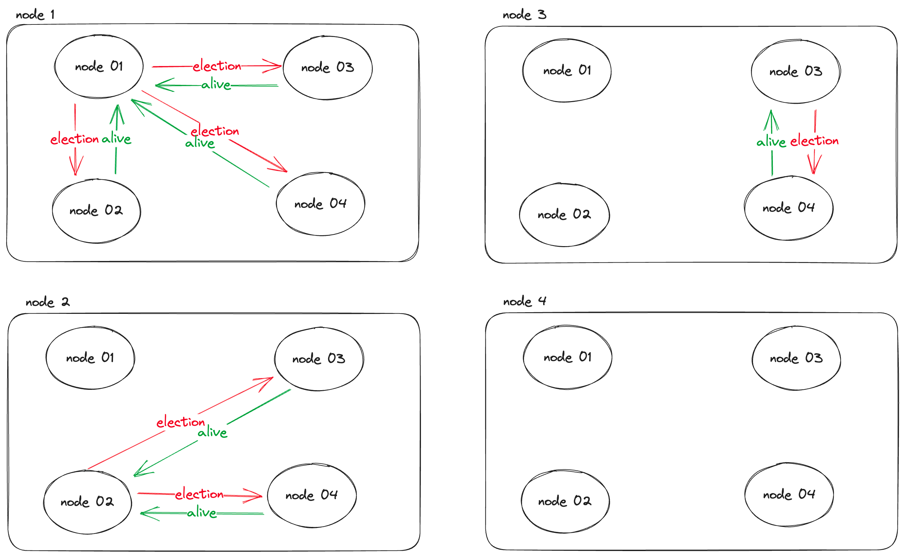
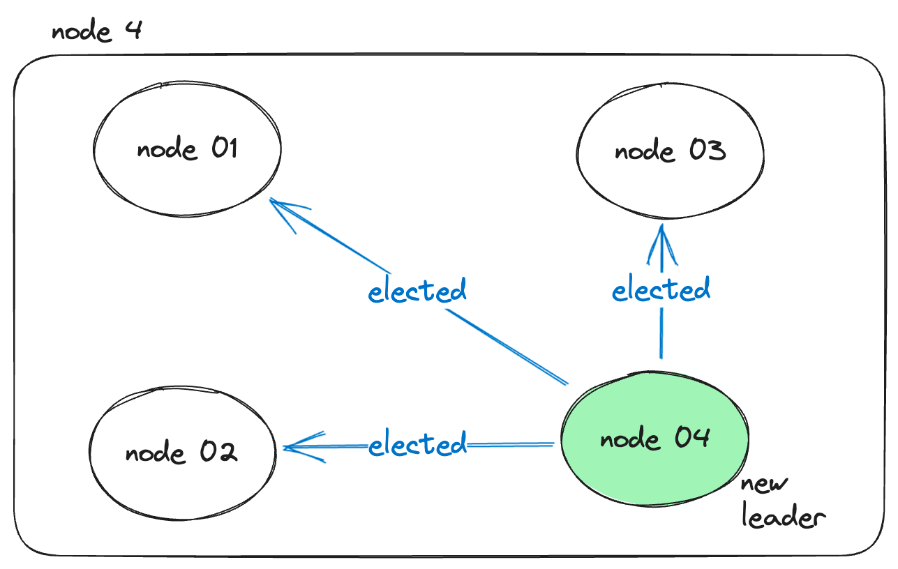
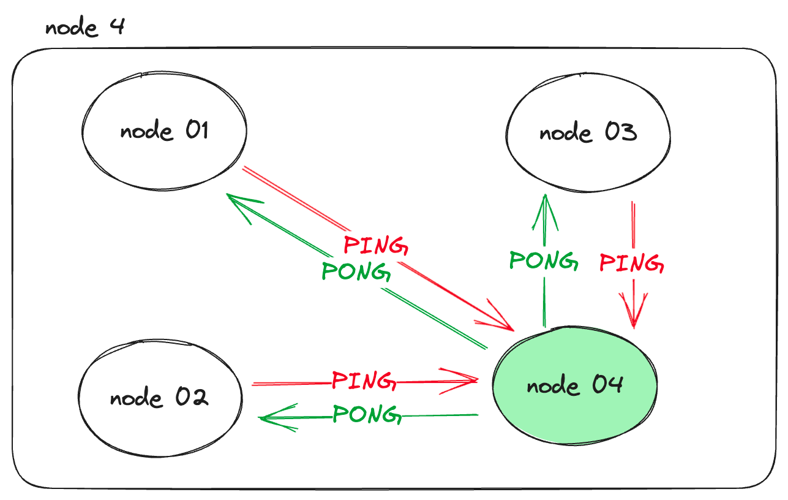
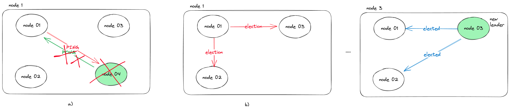

# Introduction

When I read a book called [Database Internals](https://www.amazon.com/Database-Internals-Deep-Distributed-Systems/dp/1492040347), 
I read a chapter about leader election. During the reading, to learn more, I decided to implement the most straightforward algorithm, 
called the [bully algorithm](https://en.wikipedia.org/wiki/Bully_algorithm). 
This repository implements the bully algorithm in Go using [Remote Produce Call (RPC)](https://pkg.go.dev/net/rpc).

In the bully algorithm, the fundamental idea is rank. It assumes that every node has a rank within the cluster, and 
the leader must be the highest. So it uses the node's rank value during the election.

There are two situations for election.  
* System is newly initialized, so there is no leader
* One of the nodes notices that the leader is down.

The election is implemented as follows:
1. The node sends "**ELECTION**" messages to the other nodes with higher ranks than their own.
2. The node waits for "**ALIVE**" responses.
- If no higher-ranked node responds, it makes itself a leader.
- Otherwise, it is notified of the new leader who has the highest rank.

Let's illustrate these scenarios: 

We assumed that the highest rank order, like: **node-04 > node-03 > node-02 > node-01**

- If the system is newly initialized 



Because node-04 didn't get the alive message, it became a leader and broadcasted 
the "**ELECTED**" message to notify other nodes about the election results.



The other nodes periodically send "**PING**" messages to notice the leader is down and wait for the leader's "**PONG**" responses. 
If the leader is down and the first node doesn't get "**PONG**" message, that node starts the election process again.



For example, node-01 didn't get a PONG response from the leader; it started the election process again. 
As shown above, the same operations are applied, and node-03 will be a new leader.



# Working Demo

[](https://asciinema.org/a/600162)

# Quickstart with Docker

This project has an already configured [Docker Compose file](docker-compose.yml) launching four nodes.

You can build and run docker-compose as follows:

`docker-compose up --build`

You can kill some nodes with docker commands to test the cluster behavior.

If you want to add new nodes, please add its address to hardcoded variables.

```go
// nodeAddressByID: It includes nodes currently in cluster
var nodeAddressByID = map[string]string{
	"node-01": "node-01:6001",
	"node-02": "node-02:6002",
	"node-03": "node-03:6003",
	"node-04": "node-04:6004",
}
```

In this repository, I wanted to avoid implementing a service discovery mechanism. 
I aim to learn and implement basic how to do leader election without service discovery. 

You can also find [my service discovery implementation](https://github.com/Abdulsametileri/simple-service-discovery) and 
[article](https://itnext.io/lets-implement-basic-service-discovery-using-go-d91c513883f6)

# Quickstart without Docker

You can still execute this project without using Docker.

First, change the Node IPs. For example

```go
// nodeAddressByID: It includes nodes currently in cluster
var nodeAddressByID = map[string]string{
	"node-01": "node-01:6001", <--- change here to localhost:6001
	"node-02": "node-02:6002", <--- change here to localhost:6002
	"node-03": "node-03:6003", <--- change here to localhost:6003
	"node-04": "node-04:6004", <--- change here to localhost:6004
}
```

Second, you can set which node you want to run in `Program arguments` like

`go run . node-02`

